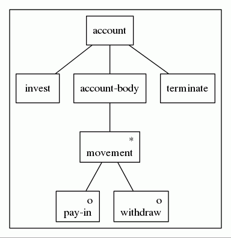

Generate Jackson tree diagrams from a DSL
=========================================

The lifetime activity of a single bank customer might be represented
as a regular expression. Given the events invest, pay-in, withdraw and
terminate, a regular expression constraints the possible ordering of
these events. ::

    account ::= invest + (payin | withdraw)* + terminate

Micheal Jackson's early work (1975) made no reference to regular
expressions, and recommended drawing tree diagrams instead. Each node
in the tree is either a sequence, an alternation, a repetition or a
symbol or literal terminal. Since the method requires that every node
in the tree have a name, nested regular expressions are not allowed. I
can rewrite the above as ::

    account ::= invest + activity + terminate
    activity ::= movement*
    movement ::= payin | withdraw

This BNF description lets me give a name to every subexpression, but
it is meant to describe full grammars, which are too powerful for my
needs. I do not want to give names a global scope and I do not want
recursive definitions.

The actual input to my program is ::

    (seq account [
        (lit invest)
        (rep activity
            (alt movement [
                (lit payin)
                (lit withdraw)]))
        (lit terminate)])

If the input file is `account.jsd`, the program from the command line
can be run as ::

    astjsd.py < account.jsd

This will write a Graphviz dot file to stdout, which may in turn be
use to create a graphic representation of the tree ::

    astjsd.py < account.jsd | dot -T pdf >account.pdf
    evince account.pdf &

